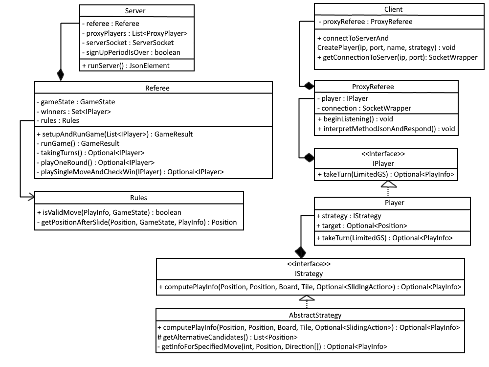

# PURPOSE

The purpose of this project and codebase is to implement the game of Labyrinth. Hackers will be able to connect to our game's server and run Player AIs to compete in Labyrinth games for prize money.

The details of Labyrinth can be found on the [course website](https://course.ccs.neu.edu/cs4500f22/maze.html).

# DIRECTORY NAVIGATION

These are the files and folders in our project-level directory:
- [Common](https://github.khoury.northeastern.edu/CS4500-F22/stoic-whales/tree/main/Maze/Common) : a directory that contains symlinks to the board and state source files
- [Client](https://github.khoury.northeastern.edu/CS4500-F22/stoic-whales/tree/main/Maze/Client) : a directory that contains symlinks to the client source file
- [Planning](https://github.khoury.northeastern.edu/CS4500-F22/stoic-whales/tree/main/Maze/Planning) : a directory that contains all planning documents for this project
- [Players](https://github.khoury.northeastern.edu/CS4500-F22/stoic-whales/tree/main/Maze/Players) : a directory that contains symlinks to the player and strategy source files
- [Referee](https://github.khoury.northeastern.edu/CS4500-F22/stoic-whales/tree/main/Maze/Referee) : a directory that contains symlinks to the referee and observer source files
- [Remote](https://github.khoury.northeastern.edu/CS4500-F22/stoic-whales/tree/main/Maze/Remote) : a directory that contains symlinks to the ProxyPlayer and the ProxyReferee source files
- [Server](https://github.khoury.northeastern.edu/CS4500-F22/stoic-whales/tree/main/Maze/Server) : a directory that contains symlinks to the server source file
- [public](https://github.khoury.northeastern.edu/CS4500-F22/stoic-whales/tree/main/Maze/public) : a directory that contains the images for the relationships between components
- [src](https://github.khoury.northeastern.edu/CS4500-F22/stoic-whales/tree/main/Maze/src) : a directory that contains all project source files and unit test source files
- makefile : the makefile used for building the project files and running unit tests
- pom.xml : an xml file that defines that this project is a Maven project and stores the dependencies used in the codebase
- xtest : a bash script for running all unit tests

# CODE BASE ROADMAP

## Milestone 8 -- Remote
### Purpose
Implement the server-client architecture atop of the existing software (game of Labyrinth).

### Components
Server: 
- Handle server-client sign-ups from remote clients.
- Create remote proxy players and send them to the referee.
- Once the referee finishes the game, this server will receive the game results and print them.

Client:
- Connects to a server over TCP and sends over one or more names over that connection to play a game with those player(s).

ProxyPlayer:
- Handle calls from the Referee by converting those calls to JSON which will be sent over the TCP 
connection between the Server and the corresponding client. 
- After carrying out the functionality, this ProxyPlayer will delegate sending back its corresponding responses 
via this player's SocketWrapper to the Referee.

ProxyReferee:
- Handle method calls from the associated ProxyPlayer by converting those JSON calls to Java data representations,
and calls those methods on this ProxyReferee's player.
- This ProxyReferee will delegate sending back its player's corresponding responses in JSON format via this ProxyReferee's SocketWrapper.

SocketWrapper
- Wrapper class for a socket that will handle sending JSON inputs and outputs over the connection.

## Milestone 9 -- Revision
### Purpose
Revise the logic of the game to utilize a sequence of multiple goals that are assigned to players over the course of the game.

## Milestone 10 -- Revised
### Purpose
Fix bugs in the codebase to meet the specifications of previous milestones, specfically milestone 9.

# HOW TO RUN TEST HARNESSES

To run the test harnesses for each milestone, enter the respective milestone folder named {Natural} and run the respective x{name} script in that folder.

For example, to run the test harness for milestone 3: 
1. Enter the folder named 3 in the top-level directory.
2. Run the script named xboard by typing `./xboard` in the terminal.
3. Enter valid input for the test, or alternatively pipe the output of one of the .json files in the Tests directory into xboard (for example, `cat Tests/0-in.json | ./xboard`).
4. The output of the test harness is then sent to the terminal.

# HOW TO RUN INTERNAL UNIT TESTS

To run the internal unit tests, enter the project-level directory Maze/ and run the script named xtest (by opening the terminal and typing `./xtest`). The project will be built using Maven, and all unit tests will be run, with the results of those tests appearing on the terminal.
